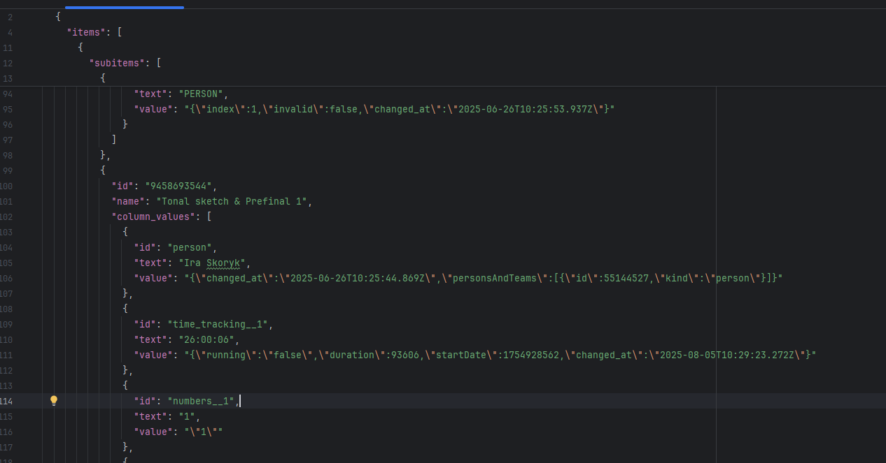
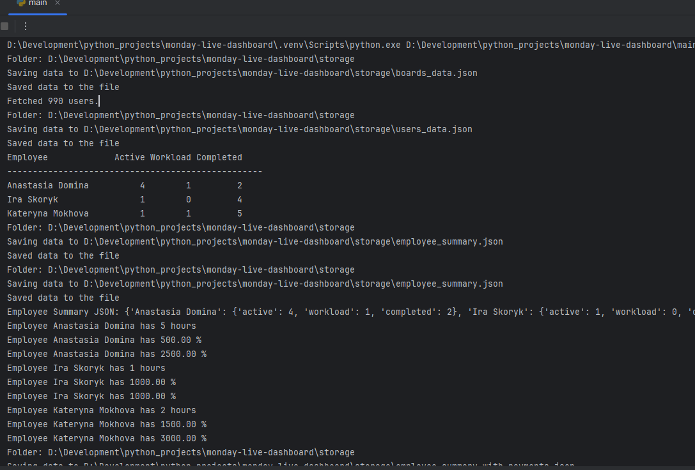

# Monday Live Dashboard


## Description
Mini app for Monday.com to show team workload and calculate additional payments.


## Technologies Used
- Python
- Requests
- dotenv


## Features
- Gets tasks from different Monday.com boards
- Shows real-time workload for each employee
- Calculates extra payments automatically


## Setup
To install the project locally on your computer, execute the following commands in a terminal:
```bash
git clone https://github.com/Illya-Maznitskiy/monday-live-dashboard.git
cd monday-live-dashboard
python -m venv venv
venv\Scripts\activate (on Windows)
source venv/bin/activate (on macOS)
pip install -r requirements.txt
```


# .env file
Create `.env` file in root by the [.env.sample](.env.sample).


## Tests
You can run flake8 linter using the following commands:
```bash
flake8
```


## Run the project
```bash
python -m main
```


## Screenshots
### Data


### Logging

